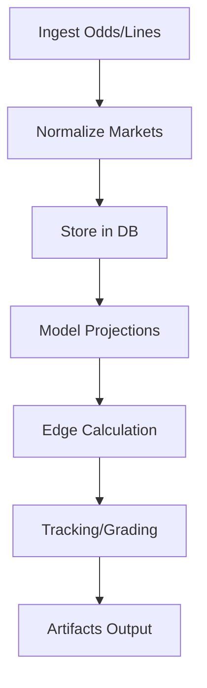

# Architecture

## Pipeline Diagram

## Module Responsibilities
- api/: FastAPI endpoints
- cli/: Typer CLI commands
- core/: Business logic modules
- migrations/: Alembic migrations
- tests/: Unit tests
- docs/: Documentation
- output/: Daily artifacts
